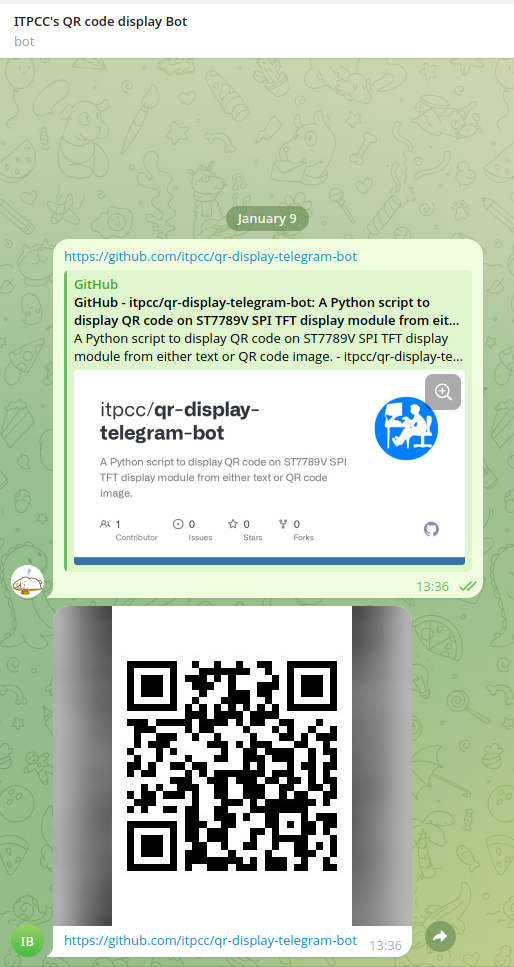
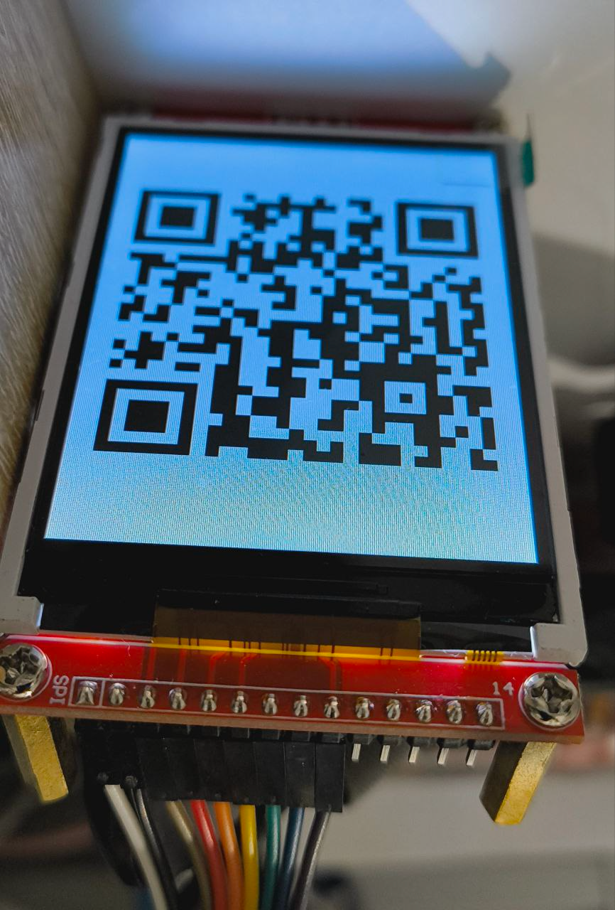

# QR code display Telegram bot

A Python script to display QR code on ST7789V SPI TFT display module from either text or QR code image.





## Table of Contents

- [Installation](#installation)
- [Usage](#usage)
- [Support](#support)
- [Contributing](#contributing)
- [LICENSE](LICENSE)

## Installation

Download to your project directory, and run the following command:

```sh
apt install libtiff6 libopenjp2-7 libatlas-base-dev libxcb1 libzbar0

pip3 install RPi.GPIO spidev numpy pillow st7789v pyzbar python-telegram-bot qrcode python-dotenv
```

## Usage

Before start the script, create .env file in the root directory with the following content:

```env
TELEGRAM_TOKEN=<Your bot telegram token>
```

Then, run the script:

```sh
python3 telegram_bot.py
```

## Support

Please [open an issue](https://github.com/leonard-henriquez/itpcc/qr-display-telegram-bot/new) for support.

## Contributing

Please contribute using [Github Flow](https://guides.github.com/introduction/flow/). Create a branch, add commits, and [open a pull request](https://github.com/itpcc/qr-display-telegram-bot/compare/).

## License

[MIT](LICENSE) © [Rachasak Ragkamnerd](https://github.com/itpcc/)
